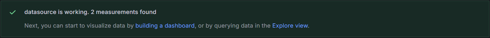
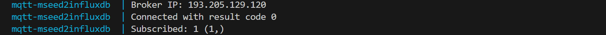
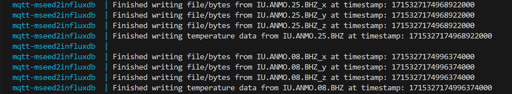
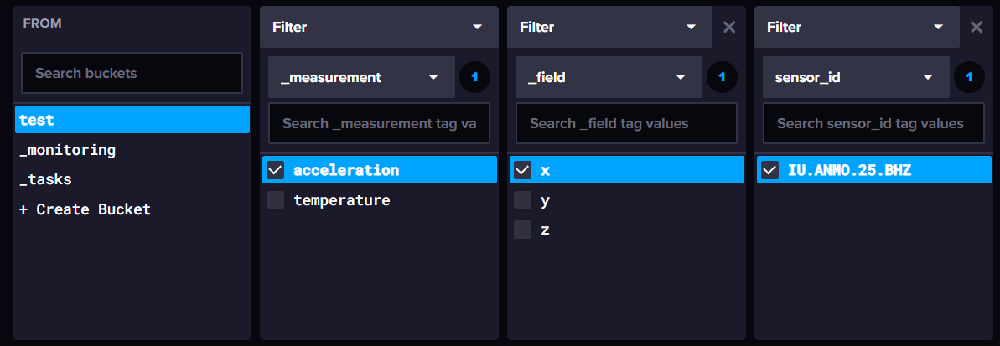

<p align="center">
    <h1 align="center">MQTT-MSEED2INFLUXDB PROXY</h1>
</p>
<p align="center">
    <em> Applicazione/Proxy Python che scrive pacchetti MSEED da MQTT su InfluxDB per la gestione e l'analisi di dati sismici.</em><br>
    <em> Progetto di Wireless Sensor Networks for IoT - UNIVPM </em>
	
</p>
<p align="center">
	
	
	
	
<p>
<p align="center">
		<em>Sviluppato con i seguenti linguaggi e tools</em>:
</p>
<p align="center">
	
	
  
  
</p>
<hr>

##  Links

> - [Sommario](#sommario)
> - [Features](#features)
> - [Struttura del progetto](#struttura-del-progetto)
> - [Modules](#modules)
> - [Come iniziare](#come-iniziare)
>   - [ Installazione manuale](#installazione-manuale)
>   - [ Installazione mediante Docker](#-installazione-mediante-docker-(consigliata))
>   - [ Running mqtt-mseed2influxdb](#-running-mqtt-mseed2influxdb)
>   - [ Tests](#-tests)
> - [ Project Roadmap](#-project-roadmap)
> - [ Contributing](#-contributing)
> - [ License](#-license)
> - [ Acknowledgments](#-acknowledgments)

---

## Sommario

<code>► INSERT-TEXT-HERE</code>

---

## Features

<code>► INSERT-TEXT-HERE</code>

---

## Struttura del progetto

```sh
└── mqtt-mseed2influxdb/
    ├── Dockerfile-proxy
    ├── Dockerfile-query
    ├── README.md
    ├── config.ini
    ├── docker-compose.yml
    ├── grafana-provisioning
    │   ├── dashboards
    │   │   ├── dashboard.yaml
    │   │   └── seismic.json
    │   └── datasources
    │       └── datasource.yaml
    ├── requirements.txt
    └── src
        ├── certs
        │   ├── ca.crt
        │   ├── client.crt
        │   └── client.key
        ├── logs
        │   └── errors.log
        ├── proxy_unified.py
        ├── query.csv
        └── query.py
```
---

##  Modules

<details closed><summary>.</summary>

| File                                                                                                        | Summary                         |
| ---                                                                                                         | ---                             |
| [docker-compose.yml](https://github.com/dennisrapaccini/mqtt-mseed2influxdb/blob/master/docker-compose.yml) | <code>► INSERT-TEXT-HERE</code> |
| [Dockerfile-proxy](https://github.com/dennisrapaccini/mqtt-mseed2influxdb/blob/master/Dockerfile-proxy)     | <code>► INSERT-TEXT-HERE</code> |
| [Dockerfile-query](https://github.com/dennisrapaccini/mqtt-mseed2influxdb/blob/master/Dockerfile-query)     | <code>► INSERT-TEXT-HERE</code> |
| [requirements.txt](https://github.com/dennisrapaccini/mqtt-mseed2influxdb/blob/master/requirements.txt)     | <code>► INSERT-TEXT-HERE</code> |

</details>

<details closed><summary>grafana-provisioning.datasources</summary>

| File                                                                                                                                   | Summary                         |
| ---                                                                                                                                    | ---                             |
| [datasource.yaml](https://github.com/dennisrapaccini/mqtt-mseed2influxdb/blob/master/grafana-provisioning/datasources/datasource.yaml) | <code>► INSERT-TEXT-HERE</code> |

</details>

<details closed><summary>grafana-provisioning.dashboards</summary>

| File                                                                                                                                | Summary                         |
| ---                                                                                                                                 | ---                             |
| [seismic.json](https://github.com/dennisrapaccini/mqtt-mseed2influxdb/blob/master/grafana-provisioning/dashboards/seismic.json)     | <code>► INSERT-TEXT-HERE</code> |
| [dashboard.yaml](https://github.com/dennisrapaccini/mqtt-mseed2influxdb/blob/master/grafana-provisioning/dashboards/dashboard.yaml) | <code>► INSERT-TEXT-HERE</code> |

</details>

<details closed><summary>src</summary>

| File                                                                                                        | Summary                         |
| ---                                                                                                         | ---                             |
| [query.py](https://github.com/dennisrapaccini/mqtt-mseed2influxdb/blob/master/src/query.py)                 | <code>► INSERT-TEXT-HERE</code> |
| [proxy_unified.py](https://github.com/dennisrapaccini/mqtt-mseed2influxdb/blob/master/src/proxy_unified.py) | <code>► INSERT-TEXT-HERE</code> |

</details>

<details closed><summary>src.certs</summary>

| File                                                                                                  | Summary                         |
| ---                                                                                                   | ---                             |
| [ca.crt](https://github.com/dennisrapaccini/mqtt-mseed2influxdb/blob/master/src/certs/ca.crt)         | <code>► INSERT-TEXT-HERE</code> |
| [client.crt](https://github.com/dennisrapaccini/mqtt-mseed2influxdb/blob/master/src/certs/client.crt) | <code>► INSERT-TEXT-HERE</code> |

</details>

---

## Come iniziare
L'installazione può essere eseguita secondo due approcci: manualmente o mediante l'utilizzo di Docker-Compose. Si raccomanda di adottare il secondo per una maggiore semplicità e coerenza nell'ambiente di esecuzione.

> [!NOTE]
> 
> _I passi riportati sono specifici per sistemi Ubuntu/Debian, ma possono essere facilmente estesi ad altri sistemi._

### Prerequisiti
Preliminarmente, è necessario installare le seguenti dipendenze.

Se si procede __manualmente__:

  - Git
  - Python:latest
  - Packages presenti in [requirements.txt](requirements.txt) mediante `pip install`

Se si procede con __docker__:
  - Git
  - Docker e Docker Compose (automaticamente installati con Docker Desktop)

### Installazione manuale
1. Clonare la repository:
   
	```sh
	$ git clone https://github.com/dennisrapaccini/mqtt-mseed2influxdb
	```
2. Scaricare e installare _InfluxDB_:
   
   	```sh
	$ curl -O https://download.influxdata.com/influxdb/releases/influxdb2_2.7.6-1_amd64.deb
    $ sudo dpkg -i influxdb2_2.7.6-1_amd64.deb
	```
    Per altri sistemi, fare riferimento alla [documentazione](https://docs.influxdata.com/influxdb/v2/install/?t=Linux) ufficiale.
> [!NOTE]
>
> _Potrebbe capitare che `curl` non riesca a scaricare correttamente il pacchetto e quindi risulta necessario scaricarlo e installarlo manualmente (es. mediante un gestore pacchetti).\
> Si __sconsiglia fortemente__ di installarlo con `sudo apt-get install influxdb` in quanto la versione non sarebbe compatibile con il presente progetto._

   
3. Scaricare e installare _Grafana_:

   	```sh
	$ wget -q -O - https://packages.grafana.com/gpg.key | gpg --dearmor | sudo tee /usr/share/keyrings/grafana.gpg > /dev/null
    $ echo "deb [signed-by=/usr/share/keyrings/grafana.gpg] https://packages.grafana.com/oss/deb stable main" | sudo tee -a /etc/apt/sources.list.d/grafana.list
    $ sudo apt update
    $ sudo apt install grafana
	```
    Analogamente al precedente, per altri sistemi, fare riferimento alla [documentazione](https://grafana.com/docs/grafana/latest/setup-grafana/installation/) ufficiale.

### Installazione mediante Docker (consigliata)
1. Clonare la repository:
   
	```sh
	$ git clone https://github.com/dennisrapaccini/mqtt-mseed2influxdb
	```
 
 2. Comporre e avviare i container di _InfluxDB_ e _Grafana_:

	```sh
	$ docker-compose up -d influxdb grafana
	```
## Configurazione
Prima di avviare l'applicazione, è necessario configurare il _broker MQTT_, _InfluxDB_, _Grafana_ e il _proxy_ modificando i file [.env](.env) e [config.ini](config.ini). 

#### Broker MQTT 
Nel file [config.ini](config.ini), sotto le sezioni `[TLS]` e `[MQTT]`, si possono modificare i vari parametri di rete e di protocollo per la comunicazione con i sensori. 
```ini
[TLS]
ca_cert = src/certs/ca.crt
client_cert = src/certs/client.crt
client_key = src/certs/client.key

[MQTT]
broker = 193.205.129.120
port = 8883
qos = 1
topic = S.H.M.
```

#### InfluxDB
Il client InfluxDB può essere configurato utilizzando le **variabili d'ambiente** (.env) (consigliato) oppure utilizzando la **UI**:
- Il file [.env](.env) contiene le **variabili d'ambiente** (modificabili a piacimento) necessarie ad InfluxDB per inizializzare un nuovo database e un client. 
  
	| **Variabile** | **Descrizione**                                                                                                                                                                                                                                                 |
	|---------------|-----------------------------------------------------------------------------------------------------------------------------------------------------------------------------------------------------------------------------------------------------------------|
	|    `USERNAME`   | Username necessario per la creazione di un nuovo utente.                                                                                                                                                                                                        |
	|    `PASSWORD`   | Password necessaria per la creazione di un nuovo utente.<br>Deve essere lunga almeno 8 caratteri.                                                                                                                                                               |
	|      `ORG`   | _Organization Name_. Un organization è un workspace per un gruppo di utenti, <br>tutti i dashboard e i bucket appartengono ad un organizzazione (es. univpm).                                                                                                                |
	|      `URL`      | L'accesso a InfluxDB e alla UI viene fatto a questo URL. L'host di default è _localhost_ con porta _8086_.<br>Se si utilizza Docker, l'host va sostituito con l'indirizzo IP del gateway tra il Docker host e il bridge<br>di rete: solitamente è _172.17.0.1_. |
	|     `TOKEN`     | Token API personalizzabile per l'autenticazione alle richieste a InfluxDB.                                                                                                                                                                                      |
	|     `BUCKET`    | Nome del bucket da creare o già creato su cui scrivere le serie temporali (es. seismic).                                                                                                                                                                                      |


- Per configurare InfluxDB attraverso l'**interfaccia grafica (UI)** (sconsigliato) occorre eliminare (o _commentare_), all'interno del file [docker-compose.yml](docker-compose.yml) la seguente porzione di codice:

> [!NOTE]
>
> _Nel caso di installazione manuale assicurarsi che i servizi InfluxDB e Grafana siano attivi eseguendo rispettivamente i comandi_ `sudo systemctl start influxdb` _e_ `sudo systemctl start grafana-server`.
  
```yaml
environment: 
   - DOCKER_INFLUXDB_INIT_MODE=setup
   - DOCKER_INFLUXDB_INIT_USERNAME=${USER}
   - DOCKER_INFLUXDB_INIT_PASSWORD=${PASSWORD}
   - DOCKER_INFLUXDB_INIT_ORG=${ORG}
   - DOCKER_INFLUXDB_INIT_BUCKET=${BUCKET}
   - DOCKER_INFLUXDB_INIT_ADMIN_TOKEN=${TOKEN}
```
  Successivamente:
  1. Visitare l'indirizzo [http://localhost:8086/](http://localhost:8086/) attraverso un qualsiasi browser.
  2. Cliccare **Get Started**.
  3. Scegliere e inserire un **Username** e una **Password**.
  4. Inserire l'**Organization Name**.
  5. Inserire il nome del **Bucket** da inizializzare.
  6. Copiare il **Token** generato
  7. Sostituire i valori dei campi nel file [.env](.env) con quelli inseriti nei punti precedenti.

#### Grafana
Sebbene una dashboard sia già stata creata e personalizzata appositamente per questo progetto (file [seismic.json](grafana-provisioning/dashboards/seismic.json)), il collegamento Grafana - InfluxDB va impostato manualmente. Grafana infatti non permette, a causa di un bug, l'uso di variabili d'ambiente per la configurazione del server.\
La configurazione si ritiene completa dopo aver visitato [http://localhost:3000/](http://localhost:3000/) da browser e aver seguito i passi sotto riportati:
1. Inserire `admin` sia come **username** che come **password** e fare il _**Log in**_.
2. Scegliere e inserire un nuovo **username** e una nuova **password** o, altrimenti, cliccare su **_skip_** per mantenere quelle di default.
3. Nel menù a tendina sulla sinistra, sotto la voce **Connection**, cliccare **Data sources** e scegliere _InfluxDB_.
4. Nella sezione **Custom HTTP Headers**, dopo aver cliccato **Reset**, inserire `Authorization` nel campo **Header** (di default) e la stringa \
   `Token mytoken` nel campo **Value**, sostituendo `mytoken` con il _token_ utilizzato per InfluxDB.
5. Nella sezione **InfluxDB Details**, nel campo **Database** inserire il nome del _bucket_ di InfluxDB ospitanti le serie temporali.
6. Cliccare su **Save & Test**. Se la configurazione è andata a buon fine comparirà un box di conferma come in figura.
   
   
   


### Uso
#### Scrittura dei pacchetti MSEED su InfluxDB
Il processing e la _scrittura_ su InfluxDB dei valori di accelerazione e di temperatura provenienti dai sensori viene gestita ed effettuata da [proxy_unified.py](src/proxy_unified.py).\
\
Per una più facile personalizzazione, vi è la possibilità di scegliere quali sensori considerare per la scrittura semplicemente aggiungendo o eliminando l'_id_ del sensore nel file [config.ini](config.ini), nella sezione `[sensors]`. \
E' possibile inoltre escludere o includere la temperatura impostando la chiave `use_temperature` con valore `True` o `False`.

```ini
[sensors]
use_temperature = True
; List of sensors to be written into InfluxDB. Delete if you want to exclude a sensor
sensors = IU.ANMO.08.BHZ, 
	  IU.ANMO.09.BHZ,
	  IU.ANMO.25.BHZ
```


Per avviare lo script eseguire da terminale, nella directory del progetto, i seguenti comandi:
- **Docker**:
  
  ```sh
  $ docker-compose up proxy
  ```

- **Manuale**:
  
  ```sh
  $ python3 src/proxy_unified.py
  ```

Se la connessione col broker MQTT è avvenuta con successo verrano stampate a video delle stringhe di conferma.


  
Da ora il programma scriverà i pacchetti MSEED su InfluxDB. Informazioni in tempo reale su ogni pacchetto scritto vengono stampate a video.



#### Visualizzazione dei dati
La InfluxDB UI permette di visualizzare (anche in real time) i dati scritti nel database. Collegandosi all'apposito indirizzo e entrando in Data Explorer  infatti, vi è la possibilità di effettuare delle query e visualizzare in modo "raw" le righe memorizzate. La tabella della parte inferiore consente di filtrare per bucket, asse, sensore e intervallo temporale: in figura se ne può vedere un esempio.

 

Se non vengono visualizzate correttamente tutte le righe è probabile che il responsabile sia la Aggregate Function automatica. Si può disattivare selezionando CUSTOM e deselezionando la funzione attiva (es. `mean`).


### Tests

To execute tests, run:

```sh
> INSERT-TEST-COMMANDS
```

---

## Project Roadmap

- [X] `► INSERT-TASK-1`
- [ ] `► INSERT-TASK-2`
- [ ] `► ...`

---

## Contributing

Contributions are welcome! Here are several ways you can contribute:

- **[Submit Pull Requests](https://github.com/dennisrapaccini/mqtt-mseed2influxdb/blob/main/CONTRIBUTING.md)**: Review open PRs, and submit your own PRs.
- **[Join the Discussions](https://github.com/dennisrapaccini/mqtt-mseed2influxdb/discussions)**: Share your insights, provide feedback, or ask questions.
- **[Report Issues](https://github.com/dennisrapaccini/mqtt-mseed2influxdb/issues)**: Submit bugs found or log feature requests for Mqtt-mseed2influxdb.

<details closed>
    <summary>Contributing Guidelines</summary>

1. **Fork the Repository**: Start by forking the project repository to your GitHub account.
2. **Clone Locally**: Clone the forked repository to your local machine using a Git client.
   ```sh
   git clone https://github.com/dennisrapaccini/mqtt-mseed2influxdb
   ```
3. **Create a New Branch**: Always work on a new branch, giving it a descriptive name.
   ```sh
   git checkout -b new-feature-x
   ```
4. **Make Your Changes**: Develop and test your changes locally.
5. **Commit Your Changes**: Commit with a clear message describing your updates.
   ```sh
   git commit -m 'Implemented new feature x.'
   ```
6. **Push to GitHub**: Push the changes to your forked repository.
   ```sh
   git push origin new-feature-x
   ```
7. **Submit a Pull Request**: Create a PR against the original project repository. Clearly describe the changes and their motivations.

Once your PR is reviewed and approved, it will be merged into the main branch.

</details>

---

##  License

This project is protected under the [SELECT-A-LICENSE](https://choosealicense.com/licenses) License. For more details, refer to the [LICENSE](https://choosealicense.com/licenses/) file.

---

##  Acknowledgments

- List any resources, contributors, inspiration, etc. here.

[**Return**](#-quick-links)

---
