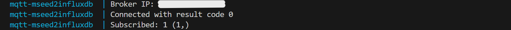
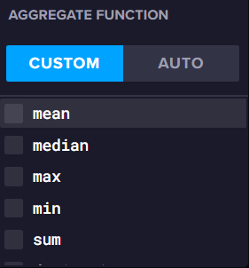
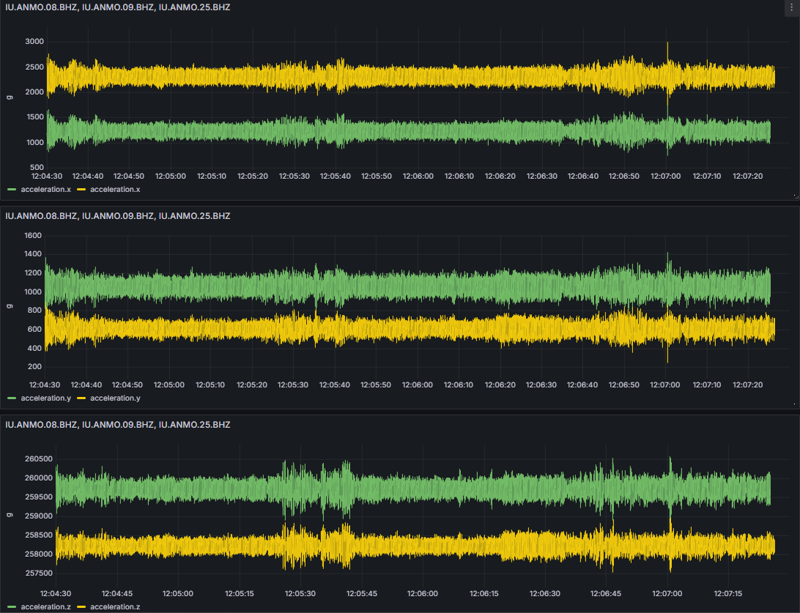

<p align="center">
    <h1 align="center">MQTT-MSEED2INFLUXDB PROXY</h1>
</p>
<p align="center">
    <em> Applicazione/Proxy Python che scrive pacchetti MSEED da MQTT su InfluxDB per la gestione e l'analisi di dati sismici.</em><br>
    
</p>
<p align="center">
	
	
	
	
<p>
<p align="center">
		<em>Sviluppato con i seguenti linguaggi e tools</em>:
</p>
<p align="center">
	
	
  
  
</p>
<hr>

##  Indice

> - [Introduzione](#intro)
> - [Struttura del progetto](#struttura)
> - [Moduli](#moduli)
> - [Diagramma logico](#diagramma)
>   - [Struttura dei sensori e del database](#struttura2)
> - [Come iniziare](#come)
>   - [ Prerequisiti](#prerequisiti)
>   - [ Installazione manuale](#manuale)
>   - [ Installazione mediante Docker](#docker)
> - [Configurazione](#configurazione)
>   - [ Broker MQTT](#broker)
>   - [ InfluxDB](#influx)
>   - [ Grafana](#grafana)
> - [Uso](#uso)
>   - [ Scrittura dei pacchetti MSEED su InfluxDB](#scrittura)
>   - [ Visualizzazione dei dati con InfluxDB](#visualizzazione)
>   - [ Visualizzazione dei dati con Grafana](#visualizzazione2)
> - [Queries](#queries)
> - [Bibliografia](#bib)

---

## Introduzione <a name="intro"></a>

Questa applicazione è stata progettata per ricevere dati da vari sensori sismici (o per monitoraggio strutturale) (accelerazione e temperatura) tramite il protocollo _MQTT_ e scriverli in un database per serie temporali (_InfluxDB_). I dati ricevuti dal _broker MQTT_ sono pacchetti di bytes in formato _MSEED_.\
Viene fornito anche uno script che effettua queries al database e le salva in _CSV_, allineando temporalmente i valori forniti dai sensori (non sincronizzati). \
Oltre agli script Python, è stata caricata una dashboard _Grafana_ specifica per questo progetto. La dashboard contiene diverse visualizzazioni grafiche (anche in real-time) dei dati ricevuti e scritti in _InfluxDB_. 

#### MSEED 
Il formato _miniSEED_ è un sottoinsieme del più articolato formato _SEED_ (Standard for the Exchange of Earthquake Data), che nasce con lo scopo di standardizzare lo scambio di dati, relativi al campo sismologico, tra le varie comunità scientifiche. \
L’organizzazione del formato e la relativa chiave di lettura è racchiusa all’interno di particolari
“blocchetti” generalmente di 8 bytes dove vengono riportate informazioni sui dati sismici o su come questi
devono essere letti ed interpretati. Nel _miniSEED_ sono presenti solo due blocchetti denominati 1000 e 1001
che costituiscono l’ultima parte di un _header_ fisso di 64 bytes, seguito dai campioni sismici costituenti il
resto del “pacchetto” che è sempre dello stesso numero di bytes all’interno del medesimo streaming di dati. [[1]](#ref1)

#### InfluxDB
InfluxDB è una piattaforma creata appositamente per raccogliere, archiviare, elaborare e visualizzare serie temporali. Le serie temporali sono una sequenza di _data points_ indicizzati in ordine temporale. I _data points_ consistono tipicamente in misurazioni successive effettuate dalla stessa "sorgente".
InfluxDB organizza le serie temporali in _buckets_ e _measurements_ (misure). Un _bucket_ può contenere più measurements. Le misure contengono più _tag_ e _fields_ (campi).
- **Bucket**: Posizione in cui vengono memorizzati i dati delle serie temporali. Un bucket può contenere più measurements.
- **Measurement**: Raggruppamento logico delle serie temporali. Tutti i punti di una determinata misurazione devono avere gli stessi tag. Una misura contiene più tag e campi.
- **Tag:** Coppie chiave-valore con valori diversi (ma generalmente poco variabili). I tag sono destinati alla memorizzazione di metadati per ogni punto, ad esempio qualcosa che identifichi la fonte dei dati (es. stazione)
- **Fields**: Coppie chiave-valore con valori che cambiano nel tempo, ad esempio: temperatura, accelerazione.
- **Timestamp**: Timestamp associato al dato. Quando vengono memorizzati su disco e interrogati, tutti i dati sono ordinati temporalmente. [[2]](#ref2)

#### Grafana
Grafana è un'applicazione web open-source per la visualizzazione di database per serie temporali (_InfluxDB, Graphite, Prometheus, OpenTSDB_), logging databases e per documenti (_Loki, Elasticsearch, Splunk, MongoDB_), database SQL (_MySQL, PostgreSQL, Redshift_),cloud metric databases (_AWS CloudWatch, GCP Monitoring, Azure Monitor_) e altre datasources. [[3]](#ref3)

---

## Struttura del progetto <a name="struttura"></a>

```sh
└── mqtt-mseed2influxdb/
    ├── Dockerfile-proxy
    ├── Dockerfile-query
    ├── README.md
    ├── config.ini
    ├── cross_corr.png
    ├── docker-compose.yml
    ├── docs
    │   └── images
    │       ├── image1.png
    │       ├── image2.png
    │       ├── image3.png
    │       ├── image4.png
    │       ├── image5.png
    │       ├── image6.png
    │       ├── image7.png
    │       ├── image8.png
    │       └── image9.png
    ├── grafana-provisioning
    │   ├── dashboards
    │   │   ├── dashboard.yaml
    │   │   └── seismic.json
    │   └── datasources
    │       └── datasource.yaml
    ├── requirements.txt
    └── src
        ├── .png
        ├── certs
        │   ├── ca.crt
        │   ├── client.crt
        │   └── client.key
        ├── correlation.png
        ├── logs
        │   └── errors.log
        ├── proxy_unified.py
        ├── query.csv
        └── query.py
```


---

##  Moduli <a name="moduli"></a>

<details closed><summary>.</summary>

| File                                                                                                        | Summary                         |
| ---                                                                                                         | ---                             |
| [docker-compose.yml](https://github.com/dennisrapaccini/mqtt-mseed2influxdb/blob/main/docker-compose.yml)   | File di configurazione per i diversi Docker container |
| [Dockerfile-proxy](https://github.com/dennisrapaccini/mqtt-mseed2influxdb/blob/main/Dockerfile-proxy)     | Dockerfile per lo script "proxy" |
| [Dockerfile-query](https://github.com/dennisrapaccini/mqtt-mseed2influxdb/blob/main/Dockerfile-query)     | Dockerfile per lo script "query" |
| [requirements.txt](https://github.com/dennisrapaccini/mqtt-mseed2influxdb/blob/main/requirements.txt)     | File contenente tutte le dipendenze di Python |
| [config.txt](https://github.com/dennisrapaccini/mqtt-mseed2influxdb/blob/main/config.ini)     | File di configurazione per la scrittura |
| [.env](https://github.com/dennisrapaccini/mqtt-mseed2influxdb/blob/main/.env)     | Variabili d'ambiente per InfluxDB |

</details>

<details closed><summary>grafana-provisioning.datasources</summary>

| File                                                                                                                                   | Summary                         |
| ---                                                                                                                                    | ---                             |
| [datasource.yaml](https://github.com/dennisrapaccini/mqtt-mseed2influxdb/blob/main/grafana-provisioning/datasources/datasource.yaml) | File di configurazione per il container di Grafana |

</details>

<details closed><summary>grafana-provisioning.dashboards</summary>

| File                                                                                                                                | Summary                         |
| ---                                                                                                                                 | ---                             |
| [seismic.json](https://github.com/dennisrapaccini/mqtt-mseed2influxdb/blob/main/grafana-provisioning/dashboards/seismic.json)     | File JSON che descrive la dashboard Grafana creata per questo progetto |
| [dashboard.yaml](https://github.com/dennisrapaccini/mqtt-mseed2influxdb/blob/main/grafana-provisioning/dashboards/dashboard.yaml) | File di configurazione della dashboard per il container di Grafana |

</details>

<details closed><summary>src</summary>

| File                                                                                                        | Summary                         |
| ---                                                                                                         | ---                             |
| [query.py](https://github.com/dennisrapaccini/mqtt-mseed2influxdb/blob/main/src/query.py)                 | Script Python per effettuare queries|
| [proxy_unified.py](https://github.com/dennisrapaccini/mqtt-mseed2influxdb/blob/main/src/proxy_unified.py) | Script Python per scrivere su InfluxDB |

</details>

<details closed><summary>src.certs</summary>

| File                                                                                                  | Summary                         |
| ---                                                                                                   | ---                             |
| [ca.crt](https://github.com/dennisrapaccini/mqtt-mseed2influxdb/blob/main/src/certs/ca.crt)         | Certificato per TLS |
| [client.crt](https://github.com/dennisrapaccini/mqtt-mseed2influxdb/blob/main/src/certs/client.crt) | Certificato per TLS|
| [client.key](https://github.com/dennisrapaccini/mqtt-mseed2influxdb/blob/main/src/certs/client.key) | Chiave per TLS|

</details>

---
## Diagramma logico <a name="diagramma"></a>

Di seguito una rappresentazione di massima del flusso logico del proxy:


### Struttura dei sensori e del database <a name="struttura2"></a>
Attualmente i sensori attivi sono 3 (_"IU.ANMO.08.BHZ", "IU.ANMO.25.BHZ" e "IU.ANMO.08.BHZ"_), ciascuno misura i valori di accelerazione sui 3 assi (x,y e z) e la temperatura.
I data points sono composti come da tabella seguente:

|     **_measurement**    | **_field** |                   **sensor_id**                  | **_time** |  **value**  |
|:-------------------------------:|:------------------:|:--------------------------------------------------------:|:-----------------:|:-------------------:|
| - _acceleration_<br>- _temperature_ | - _x_<br>- _y_<br>- _z_     | - _IU.ANMO.08.BHZ_<br>- _IU.ANMO.09.BHZ_<br>- _IU.ANMO.25.BHZ_ | In _RFC 3339_       | in _raw_ (acc) or _°C_  |

Un esempio è il seguente: 

| **_measurement** |  **_field** |  **sensor_id** |         **_time**        | **value** |
|:-----------------------:|:------------------:|:---------------------:|:-------------------------------:|:----------------:|
|     acceleration        |     x              |     IU.ANMO.08.BHZ    |     2024-05-10T09:50:00.676Z    |     1161         |
|     acceleration        |     y              |     IU.ANMO.08.BHZ    |     2024-05-10T09:50:00.676Z    |     1007         |
|     acceleration        |     z              |     IU.ANMO.08.BHZ    |     2024-05-10T09:50:00.676Z    |     259777       |
|     temperature         |     temperature    |     IU.ANMO.08.BHZ    |     2024-05-10T09:50:00.676Z    |     35.96        |
|     temperature         |     temperature    |     IU.ANMO.25.BHZ    |     2024-05-11T15:05:27.931Z    |     38.04        |

_La tabella è solo un esempio. I valori vengono salvati in modo ordinato._


---
## Come iniziare <a name="come"></a>
L'installazione può essere eseguita secondo due approcci: manualmente o mediante l'utilizzo di Docker-Compose. Si raccomanda di adottare il secondo per una maggiore semplicità e coerenza nell'ambiente di esecuzione.

> [!NOTE]
> 
> _I passi riportati sono specifici per sistemi Ubuntu/Debian, ma possono essere facilmente estesi ad altri sistemi._

### Prerequisiti <a name="prerequisiti"></a>
Preliminarmente, è necessario installare le seguenti dipendenze.

Se si procede __manualmente__:

  - Git
  - Python:latest
  - Packages presenti in [requirements.txt](requirements.txt) mediante `pip install`

Se si procede con __docker__:
  - Git
  - Docker e Docker Compose (automaticamente installati con Docker Desktop)

### Installazione manuale <a name="manuale"></a>
1. Clonare la repository:
   
	```sh
	$ git clone https://github.com/dennisrapaccini/mqtt-mseed2influxdb
	```
2. Scaricare e installare _InfluxDB_:
   
   	```sh
	$ curl -O https://download.influxdata.com/influxdb/releases/influxdb2_2.7.6-1_amd64.deb
    $ sudo dpkg -i influxdb2_2.7.6-1_amd64.deb
	```
    Per altri sistemi, fare riferimento alla [documentazione](https://docs.influxdata.com/influxdb/v2/install/?t=Linux) ufficiale.
> [!NOTE]
>
> _Potrebbe capitare che `curl` non riesca a scaricare correttamente il pacchetto e quindi risulta necessario scaricarlo e installarlo manualmente (es. mediante un gestore pacchetti).\
> Si __sconsiglia fortemente__ di installarlo con `sudo apt-get install influxdb` in quanto la versione non sarebbe compatibile con il presente progetto._

   
3. Scaricare e installare _Grafana_:

   	```sh
	$ wget -q -O - https://packages.grafana.com/gpg.key | gpg --dearmor | sudo tee /usr/share/keyrings/grafana.gpg > /dev/null
    $ echo "deb [signed-by=/usr/share/keyrings/grafana.gpg] https://packages.grafana.com/oss/deb stable main" | sudo tee -a /etc/apt/sources.list.d/grafana.list
    $ sudo apt update
    $ sudo apt install grafana
	```
    Analogamente al precedente, per altri sistemi, fare riferimento alla [documentazione](https://grafana.com/docs/grafana/latest/setup-grafana/installation/) ufficiale.

### Installazione mediante Docker (consigliata) <a name="docker"></a>
1. Clonare la repository:
   
	```sh
	$ git clone https://github.com/dennisrapaccini/mqtt-mseed2influxdb
	```
 
 2. Comporre e avviare i container di _InfluxDB_ e _Grafana_:

	```sh
	$ docker-compose up -d influxdb grafana
	```
## Configurazione <a name="configurazione"></a>
Prima di avviare l'applicazione, è necessario configurare il _broker MQTT_, _InfluxDB_, _Grafana_ e il _proxy_ modificando i file [.env](.env) e [config.ini](config.ini). 

#### Broker MQTT <a name="broker"></a>
Nel file [config.ini](config.ini), sotto le sezioni `[TLS]` e `[MQTT]`, si possono modificare i vari parametri di rete e di protocollo per la comunicazione con i sensori.
```ini
[TLS]
ca_cert = src/certs/ca.crt
client_cert = src/certs/client.crt
client_key = src/certs/client.key

[MQTT]
broker = xxx.xxx.xxx.xxx
port = xxxx
qos = 1
topic = S.H.M.
```
> [!NOTE]
>
> _Per security, non sono stati caricati i certificati necessari per il collegamento al broker MQTT._


#### InfluxDB <a name="influx"></a>
Il client InfluxDB può essere configurato utilizzando le **variabili d'ambiente** (.env) (consigliato) oppure utilizzando la **UI**:
- Il file [.env](.env) contiene le **variabili d'ambiente** (modificabili a piacimento) necessarie ad InfluxDB per inizializzare un nuovo database e un client. 
  
	| **Variabile** | **Descrizione**                                                                                                                                                                                                                                                 |
	|---------------|-----------------------------------------------------------------------------------------------------------------------------------------------------------------------------------------------------------------------------------------------------------------|
	|    `USERNAME`   | Username necessario per la creazione di un nuovo utente.                                                                                                                                                                                                        |
	|    `PASSWORD`   | Password necessaria per la creazione di un nuovo utente.<br>Deve essere lunga almeno 8 caratteri.                                                                                                                                                               |
	|      `ORG`   | _Organization Name_. Un organization è un workspace per un gruppo di utenti, <br>tutti i dashboard e i bucket appartengono ad un organizzazione (es. univpm).                                                                                                                |
	|      `URL`      | L'accesso a InfluxDB e alla UI viene fatto a questo URL. L'host di default è _localhost_ con porta _8086_.<br>Se si utilizza Docker, l'host va sostituito con l'indirizzo IP del gateway tra il Docker host e il bridge<br>di rete: solitamente è _172.17.0.1_. |
	|     `TOKEN`     | Token API personalizzabile per l'autenticazione alle richieste a InfluxDB.                                                                                                                                                                                      |
	|     `BUCKET`    | Nome del bucket da creare o già creato su cui scrivere le serie temporali (es. seismic).                                                                                                                                                                                      |


- Per configurare InfluxDB attraverso l'**interfaccia grafica (UI)** (sconsigliato) occorre eliminare (o _commentare_), all'interno del file [docker-compose.yml](docker-compose.yml) la seguente porzione di codice:

> [!NOTE]
>
> _Nel caso di installazione manuale assicurarsi che i servizi InfluxDB e Grafana siano attivi eseguendo rispettivamente i comandi_ `sudo systemctl start influxdb` _e_ `sudo systemctl start grafana-server`.
  
```yaml
environment: 
   - DOCKER_INFLUXDB_INIT_MODE=setup
   - DOCKER_INFLUXDB_INIT_USERNAME=${USER}
   - DOCKER_INFLUXDB_INIT_PASSWORD=${PASSWORD}
   - DOCKER_INFLUXDB_INIT_ORG=${ORG}
   - DOCKER_INFLUXDB_INIT_BUCKET=${BUCKET}
   - DOCKER_INFLUXDB_INIT_ADMIN_TOKEN=${TOKEN}
```
  Successivamente:
  1. Visitare l'indirizzo [http://localhost:8086/](http://localhost:8086/) attraverso un qualsiasi browser.
  2. Cliccare **Get Started**.
  3. Scegliere e inserire un **Username** e una **Password**.
  4. Inserire l'**Organization Name**.
  5. Inserire il nome del **Bucket** da inizializzare.
  6. Copiare il **Token** generato
  7. Sostituire i valori dei campi nel file [.env](.env) con quelli inseriti nei punti precedenti.

#### Grafana <a name="grafana"></a>
Sebbene una dashboard sia già stata creata e personalizzata appositamente per questo progetto (file [seismic.json](grafana-provisioning/dashboards/seismic.json)), il collegamento Grafana - InfluxDB va impostato manualmente. Grafana infatti non permette, a causa di un bug, l'uso di variabili d'ambiente per la configurazione del server.\
La configurazione si ritiene completa dopo aver visitato [http://localhost:3000/](http://localhost:3000/) da browser e aver seguito i passi sotto riportati:
1. Inserire `admin` sia come **username** che come **password** e fare il _**Log in**_.
2. Scegliere e inserire un nuovo **username** e una nuova **password** o, altrimenti, cliccare su **_skip_** per mantenere quelle di default.
3. Nel menù a tendina sulla sinistra, sotto la voce **Connection**, cliccare **Data sources** e scegliere _InfluxDB_.
4. Nella sezione **Custom HTTP Headers**, dopo aver cliccato **Reset**, inserire `Authorization` nel campo **Header** (di default) e la stringa \
   `Token mytoken` nel campo **Value**, sostituendo `mytoken` con il _token_ utilizzato per InfluxDB.
5. Nella sezione **InfluxDB Details**, nel campo **Database** inserire il nome del _bucket_ di InfluxDB ospitanti le serie temporali.
6. Cliccare su **Save & Test**. Se la configurazione è andata a buon fine comparirà un box di conferma come in figura.
   
   
   


### Uso <a name="uso"></a> 
#### Scrittura dei pacchetti MSEED su InfluxDB <a name="scrittura"></a>
Il processing e la _scrittura_ su InfluxDB dei valori di accelerazione e di temperatura provenienti dai sensori viene gestita ed effettuata da [proxy_unified.py](src/proxy_unified.py).\
\
Per una più facile personalizzazione, vi è la possibilità di scegliere quali sensori considerare per la scrittura semplicemente aggiungendo o eliminando l'_id_ del sensore nel file [config.ini](config.ini), nella sezione `[sensors]`. \
E' possibile inoltre escludere o includere la temperatura impostando la chiave `use_temperature` con valore `True` o `False`.

```ini
[sensors]
use_temperature = True
; List of sensors to be written into InfluxDB. Delete if you want to exclude a sensor
sensors = IU.ANMO.08.BHZ, 
	  IU.ANMO.09.BHZ,
	  IU.ANMO.25.BHZ
```


Per avviare lo script eseguire da terminale, nella directory del progetto, i seguenti comandi:
- **Docker**:
  
  ```sh
  $ docker-compose up proxy
  ```

- **Manuale**:
  
  ```sh
  $ python3 src/proxy_unified.py
  ```

Se la connessione col broker MQTT è avvenuta con successo verrano stampate a video delle stringhe di conferma.


  
Da ora il programma scriverà i pacchetti MSEED su InfluxDB. Informazioni in tempo reale su ogni pacchetto scritto vengono stampate a video.


#### Visualizzazione dei dati con InfluxDB <a name="visualizzazione"></a>
La InfluxDB UI permette di visualizzare (anche in real time) i dati scritti nel database. Collegandosi all'apposito indirizzo e entrando in **Data Explorer** () infatti, vi è la possibilità di effettuare delle _query_ e visualizzare in modo "raw" le righe memorizzate. La tabella della parte inferiore consente di filtrare per bucket, asse, sensore e intervallo temporale: in figura se ne può vedere un esempio.


Se, dopo aver switchato su **View raw data** e aver fatto **SUBMIT**, non vengono visualizzate correttamente tutte le righe è probabile che il responsabile sia la **Aggregate Function** automatica. Si può disattivare selezionando **CUSTOM** e deselezionando la funzione attiva (es. `mean`).



#### Visualizzazione dei dati con Grafana <a name="visualizzazione2"></a>
Accedendo all'interfaccia grafica si può visualizzare l'andamento temporale (in quasi-realtime) dei valori misurati dai sensori. E' stata infatti creata una dashboard (accessibile dalla sezione **Dashboards**) chiamata _Seismic Monitoring_ ad hoc per questo progetto. Essa contiene una moltitudine di plot ordinati e raggruppati per i diversi sensori, come nelle seguenti figure. Si è scelto di riportare i valori graficati in _g_, ossia in multipli dell'accelerazione di gravità.




#### Queries <a name="queries"></a>
I sensori, come spesso accade, non sono sincronizzati. Essi presentano infatti un delay temporale che, per alcune applicazioni, potrebbe risultare scomodo.
La soluzione proposta è stata quindi quella di realizzare uno script [query.py](https://github.com/dennisrapaccini/mqtt-mseed2influxdb/blob/main/src/query.py) che consente di effettuare _queries_ al database, allineare i valori restituiti e salvarli in _CSV_.\ Il linguaggio richiesto per le query è il Flux, apposito per le serie temporali.
La valutazione della correlazione viene fatta usando il _metodo della cross-correlazione_. Si verifica infatti che il delay temporale tra due segnali può essere calcolato secondo: $`\tau = arg\,max(R_{s_1\,s_2})`$.
Per conferma, viene calcolato anche usando il _metodo dei picchi_ il quale fornisce la distanza temporale tra il picco maggiore dei due sensori.
La sincronizzazione andrebbe eseguita seguendo i passi qui riportati:
1. Generare "artificialmente" un picco di accelerazione (es. colpo) nei pressi dei sensori.
2. Fare una query (in Flux) per un asse specificando il range temporale in modo da includere il picco (qualche secondo o meno).
3. Eseguire lo script con il seguente segmento di codice non commentato:
    ```python
  	r = delay_finder(s1,s2,250)
 	r_pk = delay_finder_pk(s1,s2,250)
 	print("Delay_xcorr: ", r, " s")
	print("Delay_peaks: ", r_pk, " s")
    ```
 4. Memorizzare i due valori restituiti dalla stampa a video dei due metodi.
 5. Ripetere i punti 2. e 3. per conferma anche per gli altri assi

Ora è possibile quindi effettuare qualsiasi query modificando nella seguente riga il valore restituito dalla procedura sopra.

 ```python
 delay = timedelta(milliseconds = 8)
 ```
    
---

##  Bibliografia <a name="bib"></a>

- [1] Analizzatore software per il formato miniSEED - Sandro Rao - INGV. https://istituto.ingv.it/images/collane-editoriali/rapporti%20tecnici/rapporti-tecnici-2014/rapporto285.pdf <a name="ref1"></a> 
- [2] Get started with InfluxDB - InfluxDB official website. https://docs.influxdata.com/influxdb/v2/get-started/ <a name="ref2"></a>
- [3] Questions tagged [grafana] - Stack Overflow. https://stackoverflow.com/questions/tagged/grafana <a name="ref3"></a>
---
